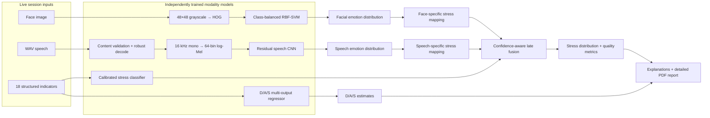
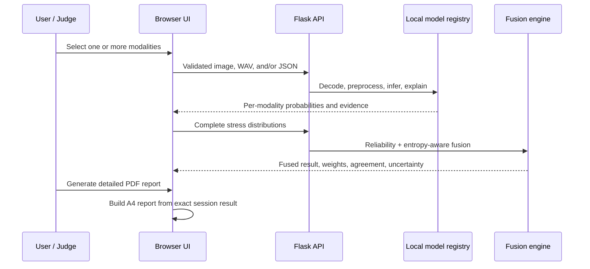
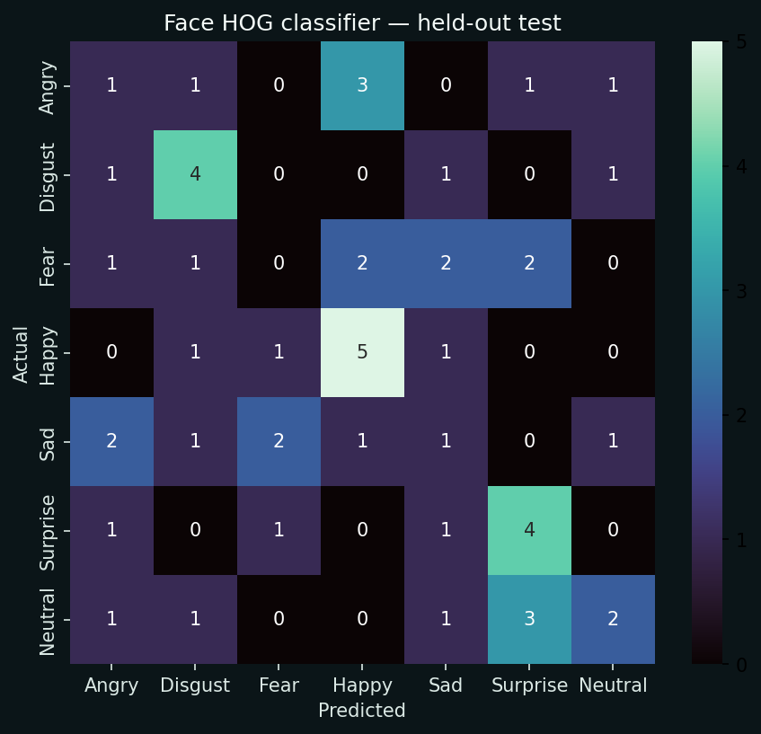
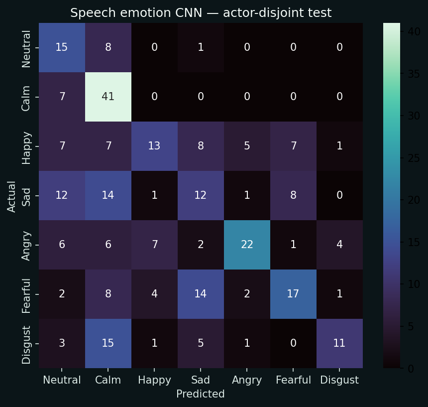

# MindFuse XAI

### Explainable multimodal mental-health decision support

[](https://www.python.org/)
[](https://flask.palletsprojects.com/)
[](#testing-and-validation)
[](#license)
[](#model-development)

MindFuse XAI is a complete Hack4Health research prototype that combines facial expression, speech emotion, and 18 behavioral/physiological indicators into an explainable four-level stress estimate. It also estimates organizer-provided Depression, Anxiety, and Stress targets, exposes evidence for every model branch, supports any non-empty modality subset, and produces a detailed printable clinical decision-support report.

> **Responsible-use notice**
>
> MindFuse XAI is an experimental decision-support system—not a medical device, diagnosis, screening test, emergency service, or replacement for a qualified mental-health professional. It does not assess suicidality, self-harm, violence, psychosis, abuse, or medical emergencies. Never delay appropriate care because of a model result.

---

## Contents

- [What the project delivers](#what-the-project-delivers)
- [Judge quick start](#judge-quick-start)
- [System architecture](#system-architecture)
- [Scientific design](#scientific-design)
- [Model development](#model-development)
- [Measured performance](#measured-performance)
- [Explainability and report generation](#explainability-and-report-generation)
- [Dataset integrity](#dataset-integrity)
- [Installation and operation](#installation-and-operation)
- [Training from scratch](#training-from-scratch)
- [API reference](#api-reference)
- [Testing and validation](#testing-and-validation)
- [Security, privacy, and safety](#security-privacy-and-safety)
- [Repository structure](#repository-structure)
- [Known limitations](#known-limitations)
- [License](#license)

---

## What the project delivers

| Capability | Implementation |
|---|---|
| Facial emotion | Audited small-data HOG RBF-SVM primary plus a residual CNN benchmark, both trained from organizer data |
| Speech emotion | Actor-disjoint residual spectrogram CNN trained from random initialization |
| Numerical stress | Validation-selected, temperature-calibrated four-class classifier over 18 indicators |
| D/A/S estimation | Validation-selected multi-output regressor with bounded presentation |
| Multimodal fusion | Reliability- and entropy-aware late fusion for one, two, or three modalities |
| Explainability | Face occlusion sensitivity/Grad-CAM, audio input-gradient saliency, numerical local sensitivity, fusion contributions |
| Decision quality | Confidence, full probability vector, agreement, normalized entropy uncertainty, and conflict flag |
| Clinical-style report | Detailed A4 print/PDF report with rationale, evidence, provenance, limitations, and reviewer sign-off |
| Batch workflow | Validated CSV inference for up to 10,000 rows with downloadable results |
| Judge demo | Training-only Good, Typical, and High strain profiles that populate all 18 numerical inputs |
| Product surface | Responsive Flask dashboard with dark/light themes and six complete pages |

The application never hard-codes assessment outcomes. Every displayed prediction is generated by a persisted locally trained artifact.

---

## Judge quick start

The trained artifacts required for inference are included under `artifacts/models/`; the large raw organizer datasets are not required to launch the demo.

```powershell
python -m pip install -r requirements.txt
python app.py
```

Open:

```text
http://127.0.0.1:5000
```

Recommended live demonstration:

1. Open **Assessment**.
2. Upload a clear PNG/JPEG face and select **Analyze facial evidence**.
3. Upload a valid WAV recording and select **Analyze voice evidence**.
4. Select **Good**, **Typical**, or **High strain** to populate all 18 structured inputs.
5. Select **Analyze numerical evidence**.
6. Select **Run multimodal assessment**.
7. Review the fused distribution, weights, agreement, uncertainty, D/A/S estimates, and explanation panels.
8. Select **Generate detailed PDF report** and choose **Save as PDF** in the browser print dialog.

The API readiness indicator should show **All models ready**. You can also check directly:

```powershell
Invoke-RestMethod http://127.0.0.1:5000/api/health
```

---

## System architecture



### Request and reporting flow



---

## Scientific design

### Why late fusion is required

The organizer face, speech, and numerical datasets contain different sample counts and no shared participant or sample identifier. They are **not paired observations**. Concatenating rows, zipping samples, or inventing correspondence would create false multimodal training examples and data leakage.

MindFuse therefore:

1. audits and splits each dataset independently;
2. trains one model per modality;
3. preserves each complete probability distribution;
4. maps facial and speech emotions separately into the four stress categories; and
5. fuses only inputs that are genuinely supplied together in one live assessment.

### Emotion-to-stress aggregation

The full calibrated emotion vector is aggregated; the engine does not map only the top emotion.

| Stress category | Facial emotions | Speech emotions |
|---|---|---|
| Healthy | Happy, Neutral | Neutral, Calm, Happy |
| Mild Stress | Sad, Surprise | Sad, Surprised |
| Moderate Stress | Fear, Disgust | Fearful, Angry |
| Severe Stress | Angry | Disgust |

The deliberate Angry/Disgust difference between modalities is implemented centrally and covered by tests.

### Confidence-aware fusion

For each available modality \(m\):

```math
c_m = 1 - \frac{H(p_m)}{\log 4}
```

```math
e_m = r_m \left(0.5 + 0.5c_m\right)
```

```math
w_m = \frac{e_m}{\sum_j e_j}, \qquad p_{fused} = \sum_m w_m p_m
```

where:

- \(p_m\) is the modality’s four-class stress distribution;
- \(H\) is Shannon entropy;
- \(r_m\) is held-out validation macro-F1;
- \(c_m\) is sample confidence;
- the 0.5 floor reduces, but does not silently discard, an uncertain modality; and
- weights are re-normalized for whatever subset is available.

Agreement is one minus weighted pairwise total-variation distance. Fused normalized entropy is reported as uncertainty. Material label/distribution disagreement raises a conflict flag.

---

## Model development

All trainable models are initialized and trained locally from organizer-supplied data. No pretrained face, speech, language, or foundation model is used.

### Facial branch

- Images are converted to 48×48 grayscale.
- A four-stage residual CNN is trained from random initialization and retained as a transparent benchmark.
- The audit found only 350 images (50 per class), so the predeclared small-data path is activated.
- A 900-dimensional 2×2-block L2-Hys HOG representation is computed without pretrained components.
- Class-balanced Logistic Regression and RBF-SVM candidates are compared using validation macro-F1.
- The selected primary is `hog_rbf_svc_C=1`.
- Validation-fitted scalar temperature calibration is applied without changing the chosen class.
- Predicted-class occlusion sensitivity explains the deployed HOG model.

The stabilization experiment improved held-out face performance without changing the split:

| Metric | Previous HOG Logistic | Current HOG RBF-SVM | Change |
|---|---:|---:|---:|
| Validation macro-F1 used for fusion | 0.2377 | 0.2822 | +0.0445 |
| Test accuracy | 0.2830 | 0.3208 | +0.0378 |
| Test macro-F1 | 0.2785 | 0.2973 | +0.0188 |
| Test macro ROC-AUC | 0.6281 | 0.7028 | +0.0747 |

### Speech branch

- Actual RIFF/WAVE content is validated independently of browser MIME.
- SoundFile/libsndfile is the primary decoder; SciPy is a tested fallback.
- PCM and floating-point WAV, metadata chunks, mono/stereo/multichannel input, multiple sample rates, and unusual but valid WAV MIME types are supported.
- Samples are converted to finite float, deterministically downmixed, DC-centered, peak-normalized, and polyphase-resampled to 16 kHz.
- Audio is padded/truncated to four seconds and transformed into a standardized 64-bin log-Mel spectrogram of shape `64 × 249`.
- A compact residual 2D CNN is initialized randomly and trained with train-only Gaussian noise and time/frequency masking.
- Actors are disjoint across train, validation, and test partitions.
- Validation temperature scaling calibrates the probability vector.
- Predicted-class input-gradient saliency explains the spectrogram.
- Explanation rendering is failure-isolated, so an optional visualization error cannot erase a valid prediction.

### Numerical stress classifier

- The same deterministic 70/15/15 row split is used by classification and regression.
- Median imputation, missing indicators, and standardization remain inside sklearn Pipelines.
- Logistic Regression, Random Forest, Extra Trees, and HistGradientBoosting are compared on validation macro-F1 and then balanced accuracy.
- The selected classifier is refitted on train + validation data and temperature-calibrated.
- Global permutation importance and local one-feature counterfactual sensitivity are exposed.

Additional RBF-SVM, discriminant-analysis, Naive Bayes, and expanded boosting experiments were performed during refinement. Some improved validation scores but regressed on the held-out partition; they were rejected rather than presented as artificial progress. The original numerical classifier remains deployed.

### D/A/S multi-output regressor

- Ridge, Random Forest, Extra Trees, and multi-output HistGradientBoosting candidates are compared.
- Selection uses mean normalized validation RMSE so targets with different ranges contribute fairly.
- Raw predictions are evaluated; documented bounds are applied only when presenting inference values.
- The report clearly states that outputs are organizer-target estimates—not administered PHQ-9, GAD-7, DASS-21, or diagnostic results.

---

## Measured performance

Metrics below are generated from persisted held-out artifacts; the UI reads the machine-readable JSON sources rather than hard-coded display values.

| Primary task | Test support | Accuracy | Balanced accuracy | Macro-F1 | Macro ROC-AUC |
|---|---:|---:|---:|---:|---:|
| Facial emotion · HOG RBF-SVM | 53 | 0.3208 | 0.3265 | 0.2973 | 0.7028 |
| Speech emotion · actor-disjoint CNN | 300 | 0.4367 | 0.4454 | 0.4232 | 0.8218 |
| Numerical stress classification | 600 | 0.3817 | 0.2819 | 0.2779 | 0.4955 |

The separate face CNN benchmark has held-out macro-F1 0.1124 on this unusually small dataset and is not the deployed face primary.

### Regression results

| Target | MAE | RMSE | R² | Explained variance |
|---|---:|---:|---:|---:|
| Depression Score | 8.5534 | 9.9161 | 0.0034 | 0.0034 |
| Anxiety Score | 6.2023 | 7.2349 | −0.0129 | −0.0056 |
| Stress Score | 9.5678 | 11.1473 | −0.0127 | −0.0126 |

These weak numerical relationships are a real limitation of the supplied data and are deliberately visible.

### Evaluation artifacts

| Face evaluation | Speech evaluation |
|---|---|
|  |  |

| Numerical classification | D/A/S regression |
|---|---|
|  |  |

Complete metrics, class-level precision/recall/F1, confusion matrices, calibration temperatures, histories, data splits, and timestamps are under [`artifacts/metrics/`](artifacts/metrics/).

---

## Explainability and report generation

### Per-modality evidence

- **Face:** complete emotion vector, stress aggregation, deployed model identity, and predicted-class occlusion sensitivity.
- **Speech:** complete emotion vector, stress aggregation, waveform, standardized log-Mel representation, and input-gradient saliency.
- **Numerical:** complete stress vector, D/A/S estimates, global permutation importance, and local sensitivity against training references.
- **Fusion:** held-out base reliability, per-sample entropy confidence, normalized contribution weight, full weighted distributions, agreement, uncertainty, and conflict.

Model sensitivity is not presented as biological mechanism or causality.

### Detailed print/PDF report

After a fused assessment, **Generate detailed PDF report** builds a dedicated A4 document from the exact in-memory session result. It includes:

1. report/session identity and generation time;
2. model-estimated category, top probability, agreement, and uncertainty;
3. an explicit numerical explanation of why the winning class was selected;
4. the complete fused probability distribution;
5. per-modality predictions, distributions, reliability, confidence, and normalized weights;
6. D/A/S estimates and ranges;
7. the ten strongest local numerical drivers with observed/reference values;
8. all 18 numerical inputs, units, and accepted UI ranges;
9. available face/audio explanation images;
10. professional review and independent safety-assessment checklists;
11. technical provenance, dataset limitations, and reviewer sign-off fields.

The browser print dialog provides **Save as PDF**. No medical diagnosis, patient identity, or hidden target label is invented.

---

## Dataset integrity

**Dataset Download:** https://drive.google.com/drive/folders/1R9ka23jnBsNDyPh6l03f2Zv3d7gyk3tR

Download Dataset and place inside data/raw/

Discovery is content/schema-driven rather than dependent on assumed folder names.

| Component | Observed organizer data | Integrity handling |
|---|---:|---|
| Speech | 2,400 paths; 1,200 unique RAVDESS-style identifiers | Duplicates removed by filename identifier; actor-disjoint splitting |
| Face | 350 images; 50 per class | Validated dimensions/content; stratified 70/15/15 split |
| Numerical | 4,000 rows × 22 columns | Canonicalized schema, numeric/label/range/missing/duplicate checks |

Important audited differences from the documents:

- the face folder contains 350 images rather than the documented 28,709;
- the speech folder contains duplicate path copies and only 1,200 unique clips;
- the documented `Surprised` speech class is absent;
- Severe Stress is only 128 of 4,000 numerical rows; and
- numerical predictors have limited relationship to the supplied labels/targets.

The exact audit is stored at [`artifacts/metrics/dataset_audit.json`](artifacts/metrics/dataset_audit.json). Dataset notes are documented in [`docs/DATASET_NOTES.md`](docs/DATASET_NOTES.md).

### Numerical inputs

`Sleep_Quality`, `Social_Engagement`, `Daily_App_Usage_Min`, `Typing_Speed_WPM`, `Session_Frequency`, `Idle_Time_Min`, `Facial_Emotion_Variance`, `Eye_Blink_Rate`, `Smile_Intensity`, `Head_Motion_Index`, `MFCC_Mean`, `MFCC_Variance`, `Pitch_Mean`, `Speech_Rate`, `Heart_Rate_BPM`, `HRV_Index`, `Skin_Temperature`, and `GSR_Level`.

### Demo profiles

[`artifacts/metrics/demo_profiles.json`](artifacts/metrics/demo_profiles.json) ships with three training-only input profiles:

- **Good:** real Healthy training row nearest the Healthy-class feature median;
- **Typical:** overall training-partition feature medians; and
- **High strain:** real Severe_Stress training row nearest the Severe-class feature median.

They populate inputs only. The normal API always generates the actual prediction.

---

## Installation and operation

### Requirements

- Python 3.11–3.13
- Windows, Linux, or macOS
- CPU is sufficient for inference
- approximately 1 GB free space for Python packages; more if downloading raw data

The project was finalized on Python 3.13.2 on Windows/CPU.

### Windows PowerShell

```powershell
py -3.13 -m venv .venv
.venv\Scripts\Activate.ps1
python -m pip install --upgrade pip
python -m pip install -r requirements.txt
python app.py
```

### Linux/macOS

```bash
python3 -m venv .venv
source .venv/bin/activate
python -m pip install --upgrade pip
python -m pip install -r requirements.txt
python app.py
```

### Production-style local serving

Waitress is included:

```powershell
waitress-serve --listen=127.0.0.1:5000 app:app
```

### Configuration

Defaults are repository-relative and can be overridden with environment variables:

| Variable | Default | Purpose |
|---|---|---|
| `MINDFUSE_DATA_ROOT` | `data` | Data root |
| `MINDFUSE_RAW_DATA_DIR` | `data/raw` | Organizer raw data |
| `MINDFUSE_ARTIFACTS_DIR` | `artifacts` | Models, metrics, figures |
| `MINDFUSE_UPLOAD_DIR` | `instance/uploads` | Ephemeral request uploads |
| `MINDFUSE_SEED` | `42` | Reproducibility seed |
| `MINDFUSE_MAX_UPLOAD_BYTES` | `20971520` | Per-request upload cap |

Copy `.env.example` values into your shell/environment as needed. Flask does not require a `.env` file for default operation.

---

## Training from scratch

The repository includes trained artifacts for judging. To reproduce the full pipeline from organizer data:

```powershell
python scripts/download_data.py
python scripts/audit_data.py
python scripts/train_all.py
```

Individual branches:

```powershell
python scripts/train_face.py
python scripts/train_audio.py
python scripts/train_tabular.py
```

Regenerate only the small demo-profile artifact from the persisted training split:

```powershell
python scripts/generate_demo_profiles.py
```

Training behavior:

- seed 42 controls Python, NumPy, and PyTorch;
- train/validation/test responsibilities are explicit;
- model selection uses validation data;
- test data are evaluated after selection;
- speech groups are actor-disjoint;
- transforms and imputation live inside shared code/Pipelines; and
- all artifact JSON is atomically written.

Raw organizer data and regenerable feature caches are intentionally ignored by Git.

---

## API reference

### Health

```http
GET /api/health
```

Reports version, model readiness, load errors, and audited dataset counts.

### Metrics and configuration

```http
GET /api/metrics
GET /api/config
```

`/api/config` includes feature metadata and the three committed demo profiles.

### Face inference

```http
POST /api/predict/face
Content-Type: multipart/form-data
Field: image
```

Accepted suffixes: PNG, JPG, JPEG. Content is validated with Pillow.

### Speech inference

```http
POST /api/predict/audio
Content-Type: multipart/form-data
Field: audio
```

Accepted suffix: WAV (case-insensitive). The endpoint validates RIFF/WAVE content rather than trusting browser MIME. Structured errors distinguish missing, empty, unsupported, corrupt, preprocessing, unavailable-model, and inference failures.

Example:

```powershell
curl.exe -X POST http://127.0.0.1:5000/api/predict/audio `
  -F "audio=@sample.wav;type=audio/x-wav"
```

### Numerical inference

```http
POST /api/predict/numerical
Content-Type: application/json
```

The body must contain exactly the required structured values; required fields, finite numbers, and documented UI ranges are validated.

### Multimodal fusion

```http
POST /api/predict/multimodal
Content-Type: application/json
```

Pass one or more complete four-class stress distributions under `modalities`. The Assessment UI calls this after retaining each genuine per-modality result.

### Batch inference

```http
POST /api/predict/batch
Content-Type: multipart/form-data
Field: csv
```

Returns CSV with predicted status, confidence, per-class probabilities, and estimated D/A/S scores. Input is limited to 10,000 rows.

---

## Testing and validation

Run all automated checks:

```powershell
python -m compileall -q app.py src scripts
node --check static/js/app.js
node --check static/js/assessment.js
python -m pytest -q
```

Final result:

```text
61 passed
```

Coverage includes:

- dataset filename/schema validation and deterministic splits;
- face/speech emotion mapping correctness;
- numerical field/range validation and score clamping;
- late-fusion normalization, missing modalities, weights, uncertainty, and conflict;
- real artifact loading and inference behavior;
- real organizer WAV endpoint requests;
- mono, stereo, multichannel, PCM 8/16/24-bit, float, and extensible WAV;
- RIFF LIST/JUNK chunks and unusual valid browser MIME types;
- SoundFile primary and SciPy fallback decoding;
- structured safe audio failures;
- optional explanation failure isolation;
- all three demo-profile artifacts/API predictions;
- every application page and required static asset;
- favicon compatibility; and
- detailed print-report contract.

A final browser smoke test exercises the complete judge sequence in headless Chrome, verifies stale-state invalidation and profile clearing, builds the report, and checks for severe console errors. See [`reports/FINAL_VALIDATION.md`](reports/FINAL_VALIDATION.md).

---

## Security, privacy, and safety

- Upload filenames are sanitized and replaced with opaque UUID names.
- Only configured extensions are accepted; audio and image content receive independent validation.
- Request size is capped.
- Uploads are written before inference and removed in `finally` cleanup.
- Windows file handles are closed before deletion.
- Raw bytes, stack traces, internal paths, and Python exception internals are not returned to browsers.
- Detailed server logging records safe diagnostics without logging media bytes.
- CSV rows and values are bounded and validated.
- Uploaded content is never executed.
- Security headers disable MIME sniffing, framing, camera, microphone, and geolocation access.
- The app has no user accounts or long-term patient store; generated reports may still contain sensitive derived information and must be handled responsibly.

This hackathon prototype is not a hardened internet-facing clinical service. Authentication, authorization, encryption governance, consent, retention policies, clinical quality management, bias validation, regulatory review, and formal threat modeling would be required before real deployment.

---

## Repository structure

```text
Hack4Health/
├── app.py                         Flask pages, API, validation, error handling
├── requirements.txt               Reproducible Python dependencies
├── pyproject.toml                  Package and pytest configuration
├── README.md                       Project guide
├── LICENSE                         MIT License
├── .env.example                    Optional environment overrides
├── docs/
│   ├── ARCHITECTURE.md
│   ├── DATASET_NOTES.md
│   ├── METHODOLOGY.md
│   ├── MODEL_CARD.md
│   └── organizer documents
├── scripts/
│   ├── download_data.py
│   ├── audit_data.py
│   ├── train_all.py
│   ├── train_face.py
│   ├── train_audio.py
│   ├── train_tabular.py
│   └── generate_demo_profiles.py
├── src/mindfuse/
│   ├── config.py, constants.py
│   ├── data/                       Discovery, validation, transforms, features
│   ├── models/                     From-scratch neural/classical models
│   ├── training/                   Leakage-safe selection/training workflows
│   ├── inference/                  Cached artifact-backed services
│   ├── fusion/                     Probability aggregation and late fusion
│   ├── explainability/             Occlusion, Grad-CAM, audio saliency
│   ├── evaluation/                 Metrics and figures
│   └── utils/                      Reproducibility and atomic JSON
├── templates/                      Six application pages and shared layout
├── static/
│   ├── css/app.css
│   ├── js/                         AJAX, state, charts, reporting
│   └── assets/favicon.svg
├── tests/                          Unit, API, artifact, media, UI-contract tests
├── artifacts/
│   ├── models/                     Trained inference artifacts
│   ├── metrics/                    Machine-readable audit/evaluation records
│   └── figures/                    Generated evaluation figures
├── reports/FINAL_VALIDATION.md
├── data/raw/                       Organizer data; ignored by Git
├── data/cache/                     Regenerable features; ignored by Git
└── instance/uploads/               Ephemeral uploads; ignored by Git
```

---

## Known limitations

1. **Not clinically validated.** Outputs are research estimates and must not be treated as diagnoses.
2. **Small facial dataset.** Only 350 organizer images were available; even the improved primary has modest held-out performance.
3. **Speech coverage.** One documented emotion class is absent, language/device diversity is limited, and actor-disjoint test support is 300.
4. **Weak numerical signal.** Classification is near chance by macro ROC-AUC, Severe Stress is underrepresented, and regression R² is near zero.
5. **Unpaired training datasets.** Late fusion is scientifically appropriate but cannot learn cross-modal interactions.
6. **Generalization unknown.** Demographics, languages, devices, recording conditions, disabilities, medications, and medical/psychiatric comorbidities may affect inputs.
7. **WAV-only speech input.** Common valid WAV variants are robustly supported; compressed MP3/AAC input is intentionally outside scope.
8. **No emergency-risk model.** A reassuring result cannot exclude acute risk.

These limitations are visible in the UI, detailed report, model card, and metrics; they are not hidden behind product styling.

---

## Additional documentation

- [Architecture](docs/ARCHITECTURE.md)
- [Methodology](docs/METHODOLOGY.md)
- [Dataset notes](docs/DATASET_NOTES.md)
- [Model card](docs/MODEL_CARD.md)
- [Final validation record](reports/FINAL_VALIDATION.md)
- [Machine-readable metrics](artifacts/metrics/)

---

## License

This project is released under the **MIT License**. See [`LICENSE`](LICENSE) for the complete standard license text.

Copyright © 2026 MindFuse XAI contributors.

---

<p align="center"><strong>MindFuse XAI</strong><br>Transparent multimodal evidence, calibrated uncertainty, and responsible human review.</p>

## Author

Yatharth Garg & Yogesh Mehta
