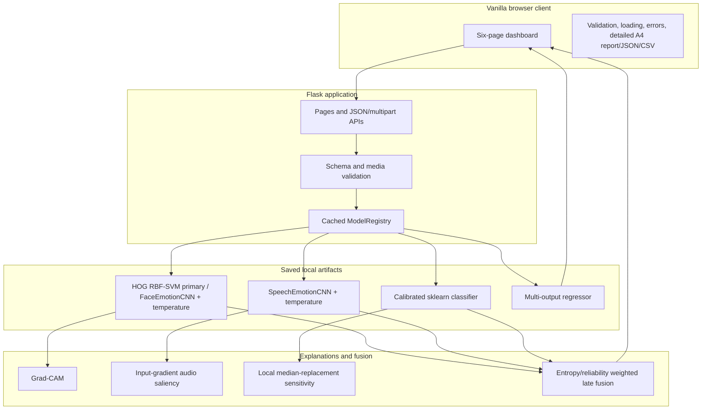

# MindFuse XAI Architecture

## Design invariants

1. Training datasets are unpaired and remain independent.
2. A request may contain any non-empty subset of modalities.
3. Only complete calibrated probability distributions enter fusion.
4. D/A/S scores are emitted only when the numerical branch is present and its saved regressor is available.
5. Request handling never triggers training and never trusts user model artifacts.

## Component view

## Request lifecycle

1. Flask enforces the 20 MB body limit.
2. An uploaded filename is sanitized only to inspect its extension; storage uses a server-generated UUID.
3. Images are decoded and dimension-checked with Pillow. WAV data is content-validated, decoded through SoundFile/libsndfile with SciPy fallback, checked for layout/finite/non-silent samples, and resampled safely.
4. Numerical JSON is checked for all 18 finite values and broad plausible limits.
5. The cached artifact performs inference. Uploaded temporary files are removed in a `finally` block.
6. Emotion branches aggregate their full emotion distribution through the correct modality mapping.
7. Fusion validates and normalizes every probability vector, adjusts held-out reliability using normalized entropy, and reports transparent contributions.
8. Structured validation/model/internal errors use HTTP 400/503/500 respectively; internal tracebacks remain in server logs only.
9. After fusion, the browser can generate a dedicated A4 report from the exact session state; the normal compact result card is not repurposed as the report.

## Artifact contract

| Artifact | Producer | Consumer |
|---|---|---|
| `face_model.pt` | facial trainer | face inference/Grad-CAM |
| `face_hog.joblib` | facial trainer | deployed face inference/occlusion sensitivity |
| `audio_model.pt` | speech trainer | audio inference/saliency |
| `numerical_classifier.joblib` | tabular trainer | numerical/batch inference and local sensitivity |
| `das_regressor.joblib` | tabular trainer | numerical/batch score estimation |
| `dataset_audit.json` | audit/train-all | health, methodology, review |
| modality metric JSON files | trainers | Performance and Explainability pages |
| `fusion_weights.json` | train-all | fusion engine and dashboard |
| figures | evaluation plotting | Performance page |

PyTorch checkpoints contain state dictionaries, class order, temperature, feature/input configuration, and seed. Joblib files are produced locally during training and are never accepted from an API caller.

## Concurrency and deployment

Models load once at process startup and are read-only during inference. Temporary upload names are collision-resistant. For a local demo use Flask; for a production-like single-host demo use Waitress. A real deployment should add authentication, encrypted storage policies, audit logging, explicit consent, monitoring, and clinical governance.
